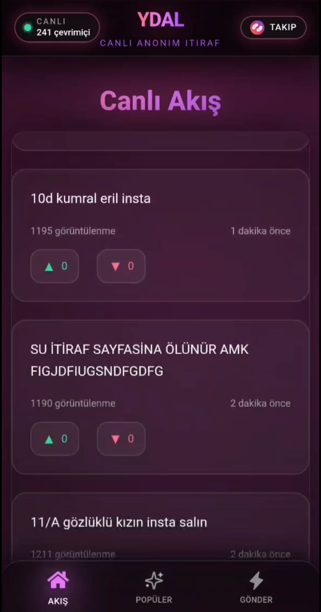
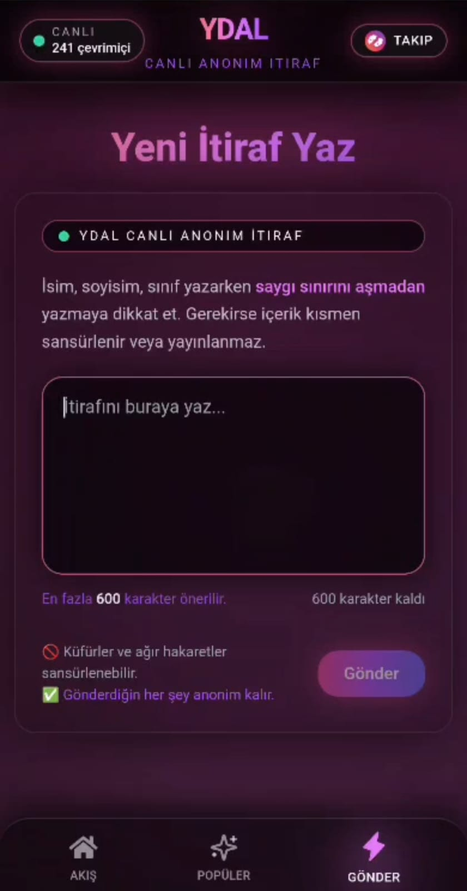

# shadownote-backend

> ShadowNote için Express + WebSocket tabanlı backend. Anonim gönderiler, akış ve Telegram bot bildirimleri. ⚡️

[](https://github.com/bucksh0tdev/shadownote-backend)
[](https://github.com/bucksh0tdev/shadownote-backend/issues)
[](https://github.com/bucksh0tdev/shadownote-backend/commits/main)
[](https://nodejs.org)
[](https://www.mongodb.com)

## ✨ Öne Çıkanlar
- Express API + WebSocket gateway
- MongoDB kalıcılık
- Anonim gönderiler için rate limit
- Telegram bot + admin bildirim akışları
- `/game` altında statik web varlıkları

## 🧭 Mimari Akış
- Client → HTTP/WS istekleri
- WS mesajları → servis katmanı
- MongoDB → kalıcı veri
- Telegram bot → bildirim akışı

## ⚙️ Kurulum
1. `.env.example` dosyasını `.env` olarak kopyala.
2. Bağımlılıkları yükle.
```bash
npm install
```
3. Sunucuyu başlat.
```bash
npm start
```

## 🔧 Ortam Değişkenleri
- `MONGODB_URI` MongoDB bağlantı adresi
- `TELEGRAM_BOT_TOKEN` Public bot token
- `TELEGRAM_NOTIFY_TOKEN` Admin bildirim bot token
- `PUBLIC_URL` Bot mesajlarında kullanılan public URL
- `DEV` `true` ise dev modu
- `NGROK_AUTHTOKEN` Dev tüneli için ngrok token
- `NGROK_DOMAIN` Dev tüneli için ngrok domain
- `PORT` Production HTTP port
- `DEV_PORT` Dev HTTP port

## 📡 Uç Noktalar
- WebSocket: `/websocket`
- Statik içerik: `/game`

## ✅ Doğrulama Kuralları
- Rate limit: IP başına dakikada 3 gönderi
- Uzunluk: 20 ile 700 karakter arası

## 📁 Proje Yapısı
- `src/index.js` Sunucu giriş noktası
- `src/config.js` Env config
- `src/modules/websocket.js` Gerçek zamanlı akış
- `src/functions` Bot ve yardımcılar
- `src/databases` Mongoose modelleri

## 📸 Ekran Görüntüleri



## 🛡️ Güvenlik Notu
- Secret ve URL değerleri `.env` içindedir.
- Repo içinde hassas bilgi tutulmaz.

## 🗺️ Yol Haritası
- Moderasyon metrikleri ve yönetim paneli
- Ölçeklenebilirlik ve kuyruk yapısı
- Daha güçlü loglama ve izleme

## 🤝 Katkı
- Issue açarak öneri bırakabilirsin.
- PR'larda mevcut kod stilini koru.

## 🔗 İlgili Repo
- Client: `shadownote-client`

## 📄 Lisans
- MIT
